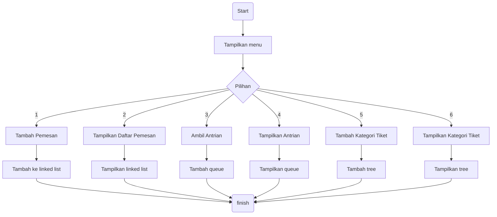
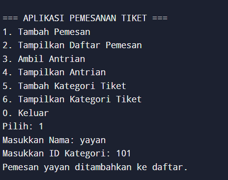
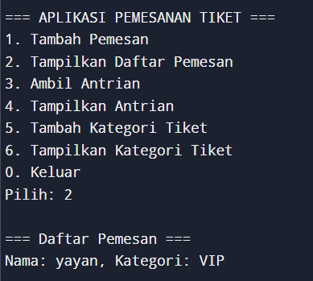
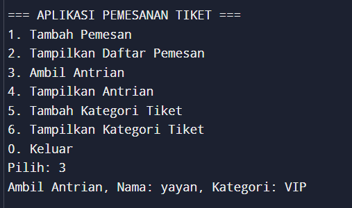
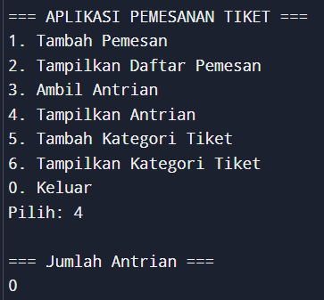
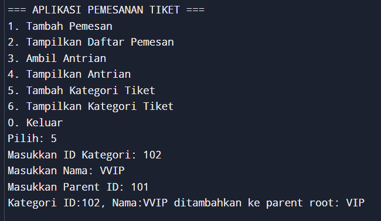
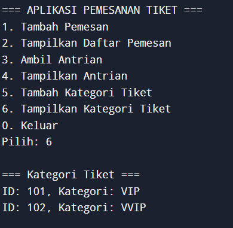

# Aplikasi Pemesanan Tiket
## Description
Applikasi yang digunakan untuk pemesanan tiket, support antrian dan kategori pemesan.

---
## Data Structures
### Pemesan
- nama
- id kategori
- kategori

### Linked List
Menyimpan daftar pemesan secara dinamis, bisa ditambah, diedit, atau ditampilkan.

Operasi:
pesan(), tampilkanPesanan()

### Queue
Menyimpan antrian pemesan.

Operasi:
pesan(), ambilAntrian(), tampilkanAntrian()

### Tree
Menyimpan hirarki kategori

Operasi:
tambahKategori(), tampilkanKategori()

## Flow chart

## Screen Shot

